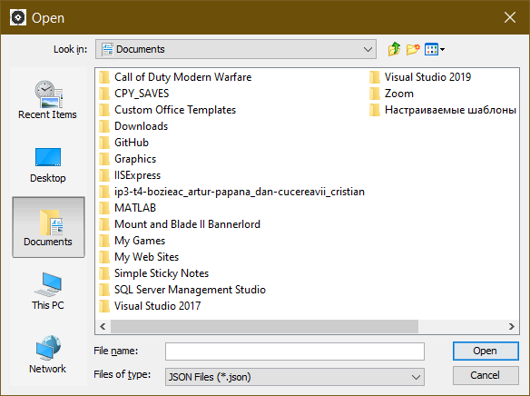
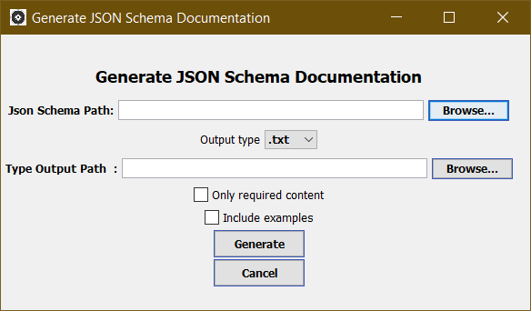
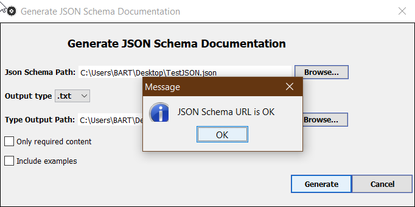
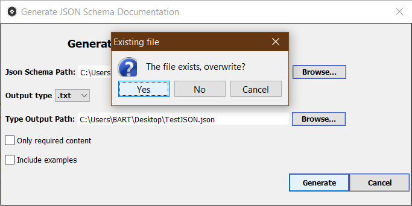
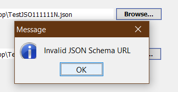
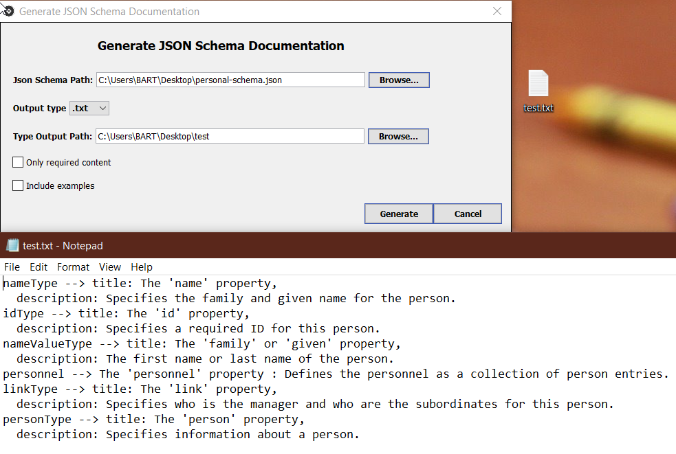
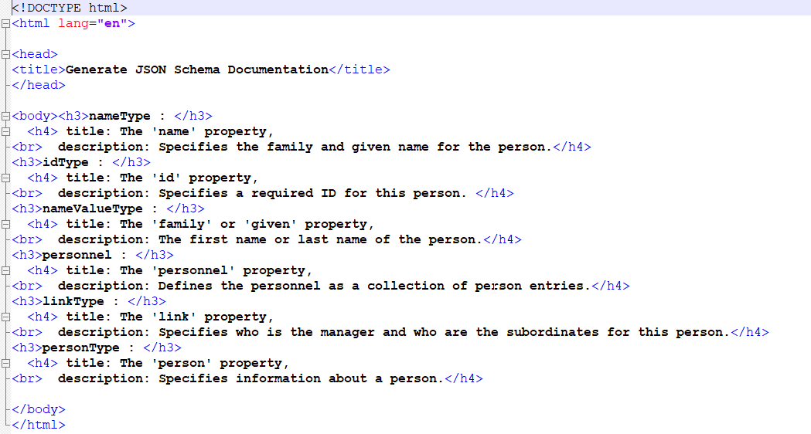
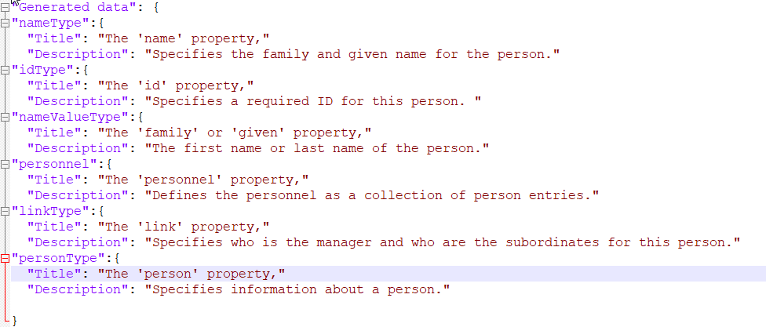

# JSON_Documentation_Generator
 
# Step 1 : Created User Inteface

Example 1.

Example 2.

# Step 2 : Created User Inteface
- Replaced JFrame with JDialog
- New UI elements positions
- When "Generate" button is pushed, it verifies if :
   - in "JSON Schema" is a valid URL, and if it is of type .json.
   - in "Output File" is selected a valid file.
   - in case if file from OutputFile already exists on disk, app shows a new dialog which ask if we 
   want to overwrite or not.
   - "Cancel" button now closes the window.

Need to be implemented : - Auto-size for textfields.

Example 3.

Example 4.

Example 5.

# Step 3 : Read JSON Schema and Write data to a file
- Used JSON-Java library to get data from JSON Schema
- Format selected data
- Write it to a txt file
   - "Generate" button now creates a new file with formatted data, if file already exists, replaces it.
   
   Example 6.

# Step 4 : Refactored to MVC
- Separated UI from App Logic
- Added commons-io dependency
- Overrided format method for HTML and JSON
- JUnit test for Generator

   Example 6.

   Example 7.

# Step 5 : Small fixes
- Verification for a possible exception from JSON Object
- Generator is reduced to only 1 file(DocGenerator)
- View now extends a JDialog, and is totally separated by Controller
- Refactored methods for parsing the file
