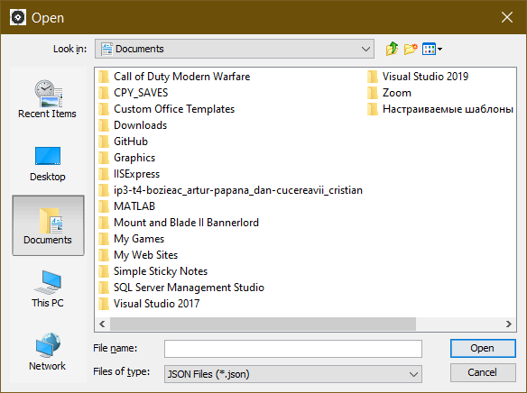
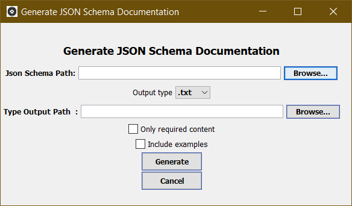
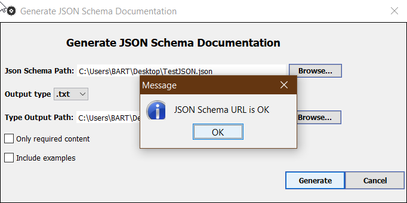
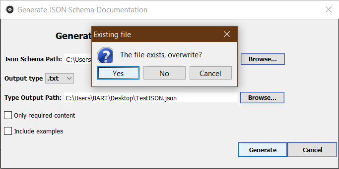
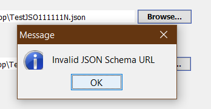

# JSON_Documentation_Generator
 
# Step 1 : Created User Inteface

Example 1.

Example 2.

# Step 2 : Created User Inteface
- Replaced JFrame with JDialog
- New UI elements positions
- When "Generate" button is pushed, it verifies if :
   - in "JSON Schema" is a valid URL, and if it is of type .json.
   - in "Output File" is selected a valid file.
   - in case if file from OutputFile already exists on disk, app shows a new dialog which ask if we 
   want to overwrite or not.
   - "Cancel" button now closes the window.

Need to be implemented : - Auto-size for textfields.

Example 3.

Example 4.

Example 5.

